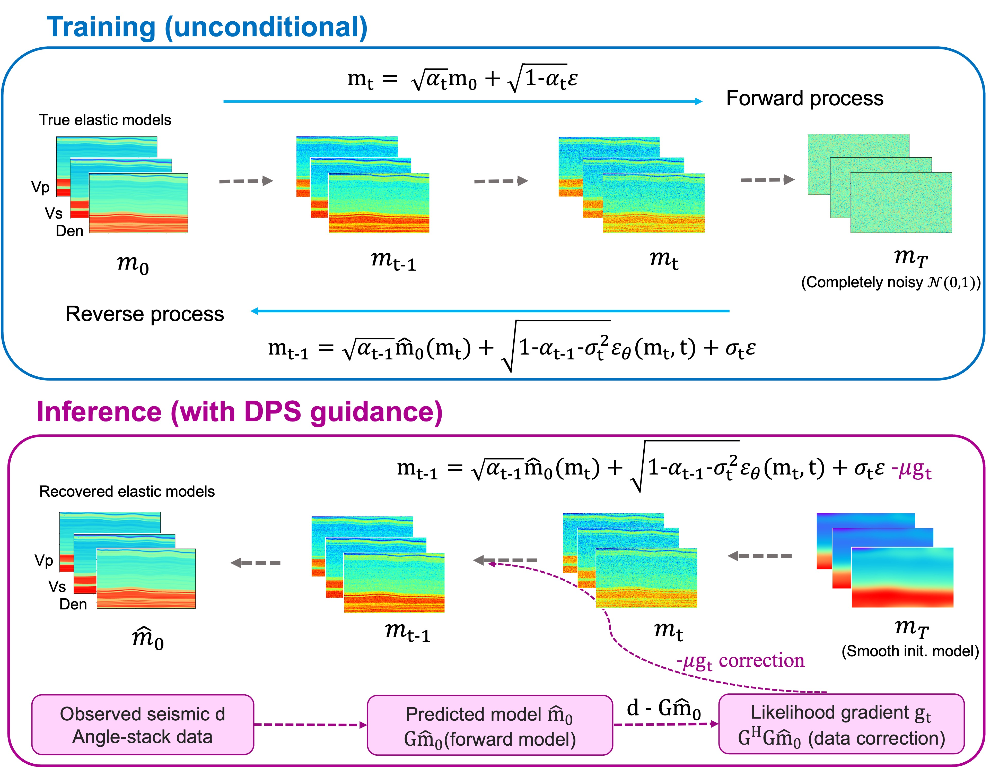

Reproducible material for **Guided Diffusion Posterior Sampling for Elastic Parameter Inversion with Angle-Stack Seismic Data - Dixit A., Brandolin F., Alkhalifah T.**

# Project structure
This repository is organized as follows:

* :open_file_folder: **diffavoinv**: python library containing routines for DPS based AVO Inversion and editing;
* :open_file_folder: **asset**: folder containing logo;
* :open_file_folder: **data**: folder containing test data of 2D Otway synthetic data and Poseidon Field angle-stack seismic (note: right now contains only the test data, no trained weight and/or datasets, because of GitHub memory issues)
* :open_file_folder: **notebooks**: set of jupyter notebooks reproducing the experiments in the paper (see below for more details);
* :open_file_folder: **scripts**: set of python scripts used to run multiple experiments ...

## Notebooks
The following notebooks are provided:

- :orange_book: ``AVOUQ_synth_otway.ipynb``: notebook performing uncertaninty quantification on synthetic otway model;
- :orange_book: ``avo_inversion_guided_ddim.ipynb``: notebook performing DPS based AVO Inversion and editing;
- :orange_book: ``dataset_avo.ipynb``: notebook performing training data and unconditional samples visulization;
- :orange_book: ``field_avo_inversion_guided_ddim_UQ.ipynb``: notebook performing DPS based avo inversion on field data and uncertanity quantification;
  
Note: to run the notebook, please download the trained model weights from the [checkpoints](https://kaust-my.sharepoint.com/personal/dixita_kaust_edu_sa/_layouts/15/onedrive.aspx?id=%2Fpersonal%2Fdixita%5Fkaust%5Fedu%5Fsa%2FDocuments%2Fcheckpoints&ga=1) folder


## Getting started :space_invader: :robot:
To ensure reproducibility of the results, we suggest using the `environment.yml` file when creating an environment.

Simply run:
```
./install_env.sh
```
It will take some time, if at the end you see the word `Done!` on your terminal you are ready to go. 

Remember to always activate the environment by typing:
```
conda activate diffseisavo
```

After that you can simply install your package:
```
pip install .
```
or in developer mode
```
pip install -e .
```

**Disclaimer:** All experiments have been carried on a Intel(R) Xeon(R) CPU @ 2.10GHz equipped with a single NVIDIA GEForce RTX 3090 GPU. Different environment 
configurations may be required for different combinations of workstation and GPU.

## Cite us 
```bibtex
@misc{dixit2026estimation,
  title        = {Estimation of Elastic Parameters with Guidance-based Diffusion model},
  author       = {Dixit, Anjali and Brandolin, Francesco and Alkhalifah, Tariq},
  year         = {2026},
  eprint       = {2607.13207},
  archivePrefix = {arXiv},
  primaryClass = {physics.geo-ph},
  doi          = {10.48550/arXiv.2607.13207},
  url          = {https://arxiv.org/abs/2607.13207}
}
```

